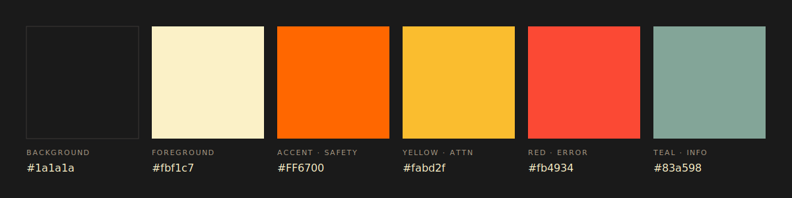

# UMI × Omarchy

**UTILITY MATERIALS INC. / OMARCHY DESKTOP / REVISION 1.0.0**

A desktop theme for [Omarchy](https://omarchy.org). Dark only. Industrial palette.

Part of the Utility Materials cross-surface theme system — companion to the [UMI Blender theme](https://github.com/alexh/umi-blender-theme), [UMI VS Code theme](https://marketplace.visualstudio.com/items?itemName=utility-materials.utility-materials-theme), and UMI Obsidian theme.

## Palette



## Design Physics

Orange is the only persistent accent. It marks activation — selection, focus, alarm — never decoration. Cream `#fbf1c7` carries high-contrast moments; warm greys (`#a89984`, `#3c3836`) carry structure.

Gruvbox-derived secondaries (red, green, yellow, teal, pink, aqua) live in the terminal's 16-color slot for syntax highlighting only. They do not appear in Waybar, Hyprland borders, Mako, Walker, or any other desktop chrome.

btop applies a two-class gradient rule: attention-worthy meters (CPU, temp, used memory, upload) ramp through safety orange to red; informational meters (free memory, cached, available, download) ramp through grey to cream. Orange is earned, not default.

## Requirements

- Omarchy 3.x
- [Nova7 icon theme](https://www.gnome-look.org/p/1379986) — skeuomorphic
  '00s/'10s-rooted set, KDE-tagged but reads as a standard XDG icon theme
  (works fine with GTK/Nautilus). Manual install:
  ```sh
  # Download the latest Nova7-X-X-X.tar.gz from the page above, then:
  cd ~/.local/share/icons && tar -xzf ~/Downloads/Nova7-*.tar.gz
  gsettings set org.gnome.desktop.interface icon-theme 'Nova7'
  ```
  (`gtk-update-icon-cache` may report the cache as invalid — harmless,
  Nautilus reads icons directly from disk without it.)
- [Silver-XCursors-3D cursor theme](https://www.gnome-look.org/p/999543) —
  chrome/silver 3D-rendered XCursor set, fits the industrial-utility motif.
  Manual install:
  ```sh
  # Download Silver-XCursors-3D-0.4.tar.lzma from the page above, then:
  cd ~/.local/share/icons && tar --lzma -xf ~/Downloads/Silver-XCursors-3D-*.tar.lzma
  ```
  The theme's `hyprland.conf` exports the right env vars, so once the
  files are on disk everything picks it up after `omarchy-theme-set umi`
  (you may need `hyprctl setcursor 'Silver-3D' 24` to refresh open windows).

## Install

Omarchy menu → **Install** → **Theme** → paste:

```
https://github.com/alexh/omarchy-umi-theme
```

Appears in the picker as `umi`.

## Recommended pairing

- **Font**: [Monaspace Krypton](https://monaspace.githubnext.com). Set in Alacritty / Ghostty / Kitty config — this theme does not override fonts.

## What's themed

- Alacritty, Ghostty, Kitty (terminals)
- Waybar (status bar)
- Hyprland (window manager, borders)
- Mako (notifications)
- Walker (app launcher)
- Hyprlock (lock screen)
- SwayOSD (volume/brightness overlay)
- btop (process monitor) — two-class gradients, per Design Physics
- Neovim — via [gruvbox-material](https://github.com/sainnhe/gruvbox-material), with background overridden to `#1a1a1a` for seamless continuity with the rest of the chrome
- VS Code — [Utility Materials Protocol](https://marketplace.visualstudio.com/items?itemName=utility-materials.utility-materials-theme)
- Chromium — window chrome color
- GTK icons — [Crystal Remix](https://github.com/dangvd/crystal-remix-icon-theme)

## Notes

- Dark only. No light variant in this repo.
- Downstream configs (alacritty, waybar, hyprland, mako, walker, hyprlock, swayosd, chromium) are generated by Omarchy from `colors.toml` via its template system. This repo ships only the palette, backgrounds, and the files that require overrides.
- Neovim requires [LazyVim](https://www.lazyvim.org) (Omarchy default). On other Neovim distributions, wire `gruvbox-material` yourself with the same background override.

## Credits

Designed by [Alex Haynes](https://alexhaynes.org) for [Utility Materials Inc.](https://utility.materials.nyc). Built on Omarchy's theme template system by [Basecamp](https://github.com/basecamp/omarchy).

## License

MIT. See [LICENSE](./LICENSE).
